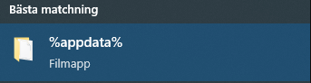

# Custom Recipes

- We use this datapack to add custom recipes to our survival minecraft server. You can use it if you want to and if you have any suggestions for recipes that should be added contact me on discord (kevie#9091)
- If you want to see every custom recipe we have added with this datapack [click here](RECIPES.md). This file will only display the recipes from the latest version of the datapack.

## How to install
- Dowload the file [here](https://github.com/thekevie/custom_recipes/releases/download/v1.0.0/Custom.Recipes.v1.0.0.zip) and search for %appdata% in your windows search bar.

- Open the folder called .minecraft and look for the folder named saves.
- In the saves folder you will find all of your world open the folder for the world you want to add the datapack to.
- Open the folder datapacks and move the datapack zip file in to the folder. 

## Favorite Recipes
### Trident 

